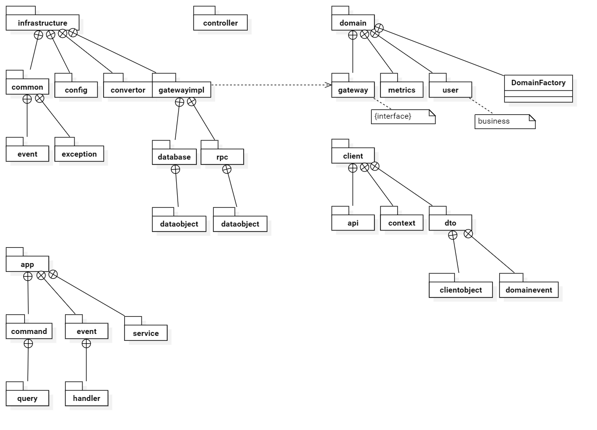

# DDD案例分析
## 项目介绍

Teamcoin Introduce

## 分包结构

## Scrum术语

+ 产品（Product）
+ 产品待办项（Backlog Item）
+ 发布（Release）
+ 冲刺（Sprint）
+ 每个待办项都包含一些任务（Task）
+ 每个任务都拥有一个估算记录条目（Estimation Log Entry）集合
+ 发布中包含计划好的待办项（Scheduled Backlog Item）
+ 冲刺中包含已提交的待办项（Committed Backlog Item）
+ 租户（Tenant）
+ 用户（User）
+ 权限（Permission）
+ 讨论（Discussion）
+ 论坛（Forum）
+ 讨论帖（Post）
+ 共享日历（Shared Calendar）
+ 支付（Payment）
+ 销售支持计划（Support Plan）
+ 跟踪支持事件（Incident）
+ 支持（Support）
+ 账户（Account）
+ 团队（Team）
+ 产品负责人（Product Owner）
+ 团队成员（Team Member）
+ 人力资源利用率（Human Resource Utilization）
+ 利用率（Utilization）
+ 可用性（Availability）
+ 日常的日历条目（Calendar Entry）
+ 提醒（Reminder）
+ 团队里程碑（TeamMilestone）
+ 计划会议（Planning Meeting）
+ 回顾会议（Retrospective Meeting）

- 组织能力
  - 一体化的研发运营能力
  - 敏捷的产品化运营能力
- 业务能力
  - 领域模型的构建能力
  - 对领域模型的持续演进能力
  - 业务能力的复用、融合和产品化运营能力
  - 快速响应市场的商业模式创新能力
- 数据能力
  - 数据融合能力
  - 数据服务能力
  - 数字化运营支撑能力
- 技术能力
  - 微服务架构体系化设计能力
  - 开发和架构演进能力
  - 自动化运维管理和风控控制能力