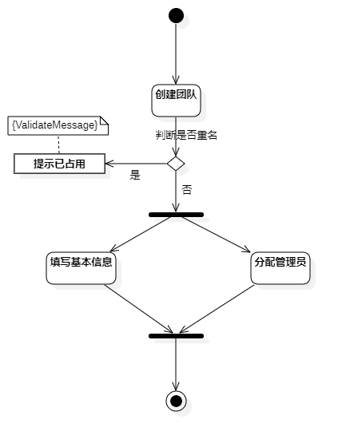
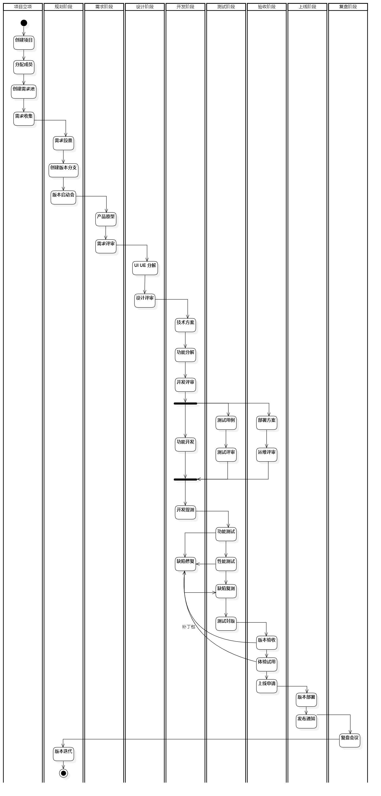

# 活动图 (Activity Diagram)
活动是某件事情正在进行的状态。活动在状态机中表现为一个由一系列动作组成的非原子的执行过程。活动图描述活动的顺序，展现从一个活动到另一个活动的控制流。活动图在本质上是一种流程图。活动图着重表现从一个活动到另一个活动的控制流，是内部处理驱动的流程。
## 活动图中组成元素
组成元素 | 说明 | 符号
:--- | :--- | :---
活动 (Activity) | 动作状态 （Action State）是指执行原子的、不可中断的 动作，并在此动作完成后通过完成转换，转向另一个状态的状态。活动状态（Activity State）用于表达状态机中的非原子的运行 | 用圆角矩形表示 
动作流(Action Flow) | 所有动作状态之间的转换流称之为动作流 | 用带箭头的直线表示
判断 (Decision) | 条件行为用分支（Branch）与合并（Merge）表达，一个分支有一个入转换和两个带条件的出转换，出转换的条件应当是互斥的；一个合并有两个带条件的入转换和一个出转换，合并表示从对应的分支开始条件行为的结束 | 用空心小菱形表示
并发区域(synchronization) | 分叉（Fork）用于将动作流分为两个或者多个并发运行的分支，而汇合（Join）则用于同步这些并发分支，以达到共同完成一项事务的目的 | 用加粗的水平线段表示
对象节点 (Object Node) | 动作状态或者活动状态与对象之间的依赖关系，表示动作使用对象或者动作对对象的影响 | 用实线矩形表示 
变量 (Variable) | 变量是一种可连接元素，它可以在活动执行期间储存值 | 用虚线矩形表示 
泳道（Swimlane）| 将活动图中的活动化分为若干组，并把每一组指定给负责这组活动的业务组织即对象 | 用线框格子表示
开始 (Start) | 活动开始 | 用实心圆点表示
结束  (End) | 活动结束 | 用圆形内嵌圆点表示

## 活动图例子
### 1、创建团队

### 2、产研流程
