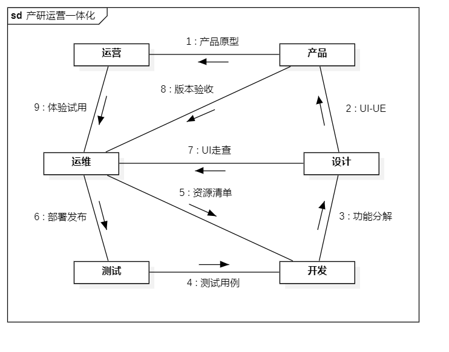

# 通讯图 (Communication Diagram)

通信图，以前称之为协作图，是一种交互图，所显示消息与时序图相似，但是它更侧重于对象间的联系。顺序图强调先后顺序，通信图则是强调相互之间的关系。顺序图和通信图基本同构，但是很少使用通信图，因为顺序图更简洁，更直观。

## 通讯图中组成元素

| 组成元素                    | 说明                     | 符号                   |
| --------------------------- | ------------------------ | ---------------------- |
| 生命线（Lifeline）          | 对象的生命周期           | 用虚线表示             |
| 连接件（Connector）         | 对象链接                 | 用直线表示             |
| 自连接件（Self Connector）  | 对象自链接               | 用直线指向自己表示     |
| 转发消息（Forward Message） | 消息的顺序通过编号码显示 | 用带正向箭头的直线表示 |
| 逆向消息（Reverse Message） | 消息的顺序通过编号码显示 | 用带反向箭头的直线表示 |

## 活动图例子

