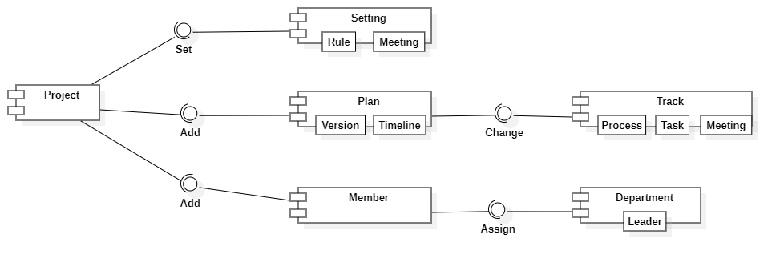

# 组件图 (Component Diagram)

组件图又称构件图，描绘了系统中组件提供的、需要的接口、端口等，以及它们之间的关系。

## 组件图组成元素

| 组成元素            | 说明                                                         | 符号                                 |
| ------------------- | ------------------------------------------------------------ | ------------------------------------ |
| 组件 (Component)    | 系统的模块化部分，系统功能可重用的单元                       | 用左侧带有突出两个小矩形的矩形来表示 |
| 接口 (Interface)    | 由一组操作组成，它指定了一个契约，这个契约必须由实现和使用这个接口的构件所遵循 | 用实心圆来表示                       |
| 端口（Port）        | 属于外部接口，是被封装组件与外界的交互点。实现接口的组件使用端口来收发消息，与外界交互 | 用正方形框来表示                     |
| 部件（Part）        | 指定某一个组件内部的部件之间的连接                           | 用长方形框来表示                     |
| 连接线（Connector） | 用来连接两个或者多个实例使他们直接能够进行交流协作。         | 用直线来表示                         |

### 组件图的关系

1. 实现：表示一个模型元素提供另一个模型元素实现的规范，组件与接口之间的关系
2. 泛化 (Generalization)：表示一个模型元素是另一个模型元素的特例化，继承关系
3. 依赖 (Dependency)：表示更改一个模型元素就会影响另一个模型元素

## 组件图例子

