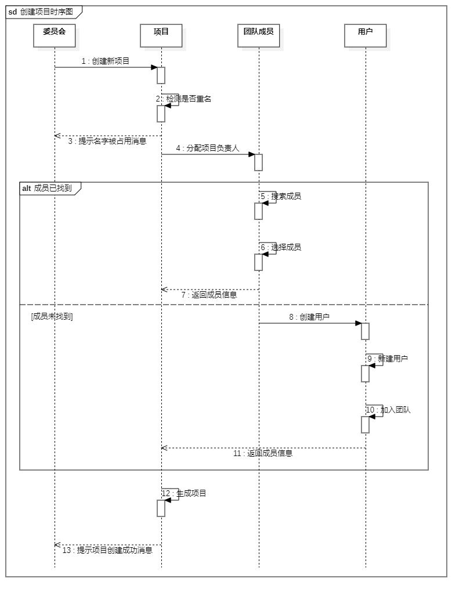

# 时序图（Sequence Diagram）

显示对象之间交互的图，这些对象是按时间顺序排列的。顺序图中显示的是参与交互的对象及其对象之间消息交互的顺序。时序图中包括的建模元素主要有：角色(Actor)、对象（Object）、生命线（Lifeline）、控制焦点（Focus of control）/ 激活（Activation）、消息（Message）、组合片段（Combined Fragments）/交互片段（Interaction Fragment）。

## 时序图组成元素

| 组成元素                                           | 说明                                                         | 符号                       |
| :------------------------------------------------- | :----------------------------------------------------------- | :------------------------- |
| 角色 ( Actor )                                     | 用以表示和系统进行交互的参与者角色，不一定是人也可以是物或者系统 | 用小人表示                 |
| 对象 ( Object )                                    | 对象就是类的实例                                             | 用矩形框表示               |
| 生命线 ( Lifeline )                                | 对象在某一用例中的生命周期                                   | 用虚线表示                 |
| 控制焦点 ( Focus of Control ) / 激活（Activation） | 代表对象在某一用例过程中执行某一操作的时间                   | 用方块表示                 |
| 消息（Message）                                    | 角色和对象或者对象与对象之间的信息传递                       | 用带箭头的直线表示         |
| 同步消息（Synchronous Message）                    | 把信息传递给接受者后，停止活动，等待返回结果                 | 用双箭头的直线表示         |
| 异步消息（Asynchronous Message）                   | 把信息传递给接受者后，不用等待返回结果                       | 用单箭头的直线表示         |
| 返回消息（Return Message）                         | 代表从过程调用返回                                           | 用双箭头的虚线表示         |
| 自关联消息（Self-Message）                         | 方法的自身调用或者一个对象内的一个方法调用另外一个方法       | 用双箭头的直线指向自己表示 |

### 组合片段（Combined Fragments）/ 交互片段（Interaction Fragment）

1. 抉择（Alt）：表示多个消息序列下根据不同条件互斥的选择，类似于if...else

2. 选项（Opt）：表示一个可能存在又可能不存在的消息通信过程
3. 循环（Loop）：表示该消息通信的过程多次根据条件重复执行，类似于for
4. 并行（Par）：表示对象生命线中持续进行消息通信的部分
5. 中断（Break）：表示序列中如果选择一个序列则要放弃其他序列的情况，类似于switch里的break
6. 强顺序（Strict）：表示多个操作片段必须按照顺序发生
7. 弱顺序（Seq）：多个操作片段在同一生命线上必须按照片段顺序发生，如果是不同的生命线则可以是并行发生

## 时序图例子

