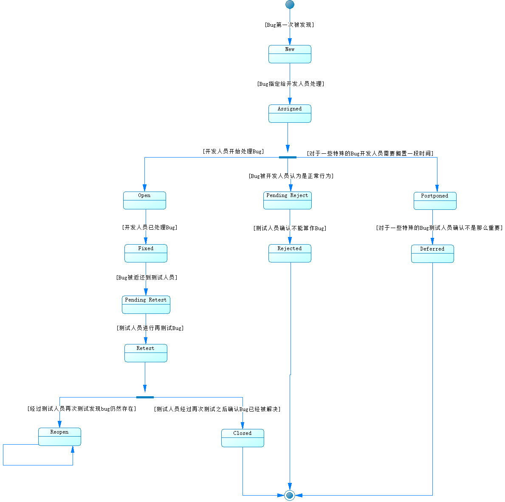

# 状态图 (Statechart Diagram)

用于描述一个对象在其生存期间的动态行为，表现为一个对象所经历的状态序列，引起状态转移的事件（Event），以及因状态转移而伴随的动作（Action）。一般可以用状态机对一个对象的生命周期建模，状态图用于显示状态机（State Machine Diagram），重点在与描述状态图的控制流。它和活动图的区别在于，活动图是描述事物发生的流程，是多个角色参与的，而状态机描述的是事物的状态变化，并没有角色这个概念。

## 状态图组成元素

| 组成元素                     | 说明                                                         | 符号               |
| :--------------------------- | :----------------------------------------------------------- | :----------------- |
| 状态 (State)                 | 指在对象的生命周期中的某个条件或者状况，在此期间对象将满足某些条件、执行某些活动活活等待某些事件。所有对象都有状态，状态是对象执行了一系列活动的结果，当某个事件发生后，对象的状态将发生变化。动作（Action）是一个可执行的原子操作，可以定义进入动作（Entry Action ），状态保持不变时执行的动作(Do Action)和退出动作（Exit Action）；嵌套在另外一个状态中的状态称之为子状态（sub-state）,一个含有子状态的状态被称作组合状态（Compound State） | 用圆角矩形表示     |
| 转移（Transition）           | 两个状态之间的一种关系，表示对象将在源状态（Source State）中执行一定的动作，并在某个特定事件发生而且某个特定的警界条件满足时进入目标状态（Target State）；事件标记（Trigger）是转移的诱因，可以是一个信号，事件、条件变化（a change in some condition）和时间表达式；当警界条件（Guard Condition）满足时，事件才会引发转移（Transition）；结果（Effect）指对象状态转移后的结果 | 用带箭头的直线表示 |
| 自身转移（Self-Transitions） | 状态可以有返回自身状态的转移                                 | 用带箭头的直线指向自己表示 |
| 并发区域(Synchronization) | 说明组合状态在某一时刻可以同时达到多个状态 | 用加粗的水平线段表示 |
| 初态 (Start) | 初始状态 | 用实心圆点表示 |
| 终态  (End) | 结束状态 | 用圆形内嵌圆点表示 |

## 活动图例子

