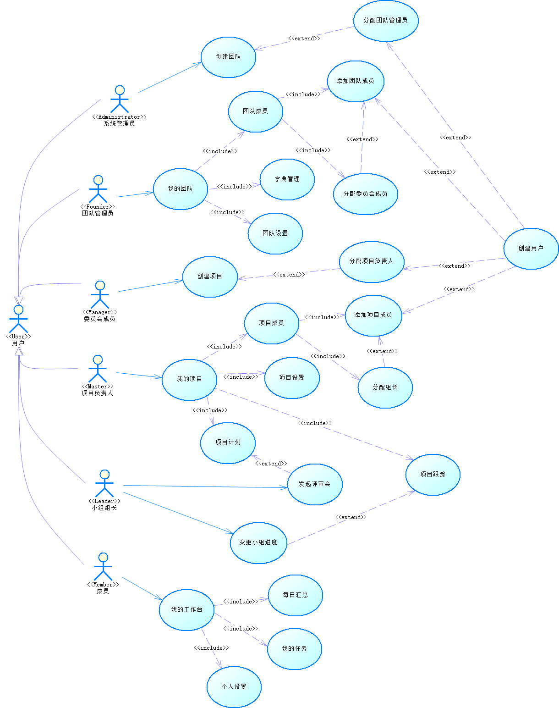

# 用例图 (User Case Diagram)
用例图主要用来描述角色以及角色与用例之间的连接关系。说明的是谁要使用系统，以及他们使用该系统可以做些什么。
## 用例图中组成元素
组成元素 | 说明 | 符号
:--- | :--- | :---
执行者 (Actor) | 表示与你自己的程序或者系统进行正在交互的动作 | 用小人表示
用例 (Use Case) | 表示在一个系统或者程序中某个功能的描述 | 用椭圆代表
关联关系 (Association) | 表示参与者与用例之间的关系 | 用箭头表示
包含关系 (Include) | 表示一个大的功能分解成多个小模块的动作 | 用带包含文字的虚线箭头表示
扩展关系 (Extend) | 表示用例功能的延伸，相当于是为用例提供附加功能 | 用带扩展文字的虚线箭头表示
依赖 (Dependency) | 表示一个用例依赖于另一个用例（相当于程序里面的一个类引用另一个类的关系） | 用带依赖文字的虚线箭头表示
泛化关系 (Generalization) | 相当于程序里面的继承关系 | 用箭头表示

## 用例图例子

## 理解误区
+ 误区1：用例就是功能点
> 功能点是站在软件开发的角度来说的，而用例是站在用户的角度来说的，所以获取用例的关键就是**要站在用户角度看问题**。

+ 误区2：用例和步骤混淆
> 用例的特征是有目的，有用户期望，有回报预期。当结果不可定义或不清晰时不能用Use Cases，意思是如果目标成功或目标失败不能有一个明确的定义，那就不是一个用例。

+ 误区3：用例的粒度不明 
> 用例的粒度大小要看情况，因地制宜，因时制宜。 
> 
> 因地制宜：一般系统用例10-50个为宜。比较小型系统可以粒度更小一些。
> 
> 因时制宜：在业务建模阶段，在概念建模阶段，在系统建模阶段都是不同的。在系统建模阶段，用例的粒度是以每个用例能够描述操作者与计算机的一次完整的交互为宜。根据项目的不同阶段，不断缩小边界可以获得更小的粒度用例。

+ 误区4：用例和场景混淆
> 一个用例的执行是要有前因和后果的（前提是什么，结果会怎么样），一个用例的不同场景，但用户的最终目的都是一样的。

+ 误区5：用例直接推导出设计
> 不要从用例直接推论出设计。用例止于系统接口的边界，描述参与者使用系统时所遵循的次序。